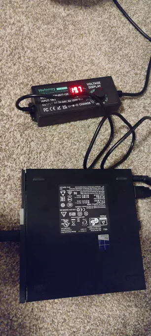
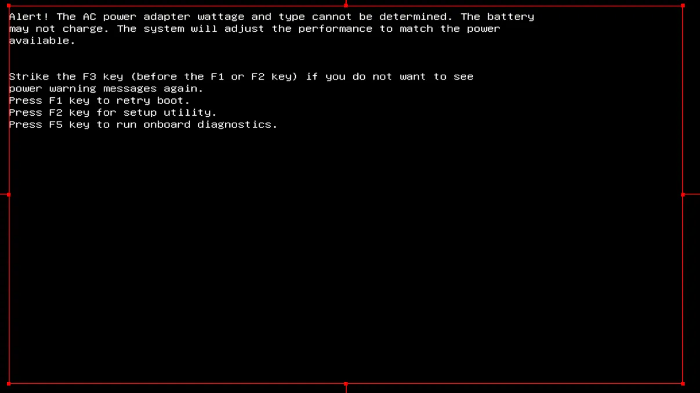

> Hold up, you mean those tiny affordable desktop computers are bad?

**Yes, I am.**

# It's too smart for it's own good

If you were like me, you heard about "MiniMicro" via youtubers who advertise capable devices for cheap off hardware surplus.

Well... They are right, but there is one problem they all skirt over.

**The power supply cannot be replaced**

## Why can't it be replaced?

Because these devices MAY have a 3rd pin on their barrel jack, This is a data cable that will tell your computer if this is a "genuine" power supply, Which I can guarantee I don't have, or have any interest to run.

When it cannot detect a genuine power supply, it assumes the worst and throttles your CPU. There is nothing we can do to bypass this.

 

This will lead to 2 problems.

- No possible 3rd party replacement
- Impossible to use with HomeCompute

Avoid these. Save yourselves the headache.

## What now?

This invalidates my entire stock of spare computers, which are heading to the nearest garbage can as we speak. Thankfully, this frees me from spending any more money towards troubleshooting these computers. Sadly, I have no more spare computers, meaning I need entire new stock, Which I am fiscally limited in doing at the moment. I also need to ensure my new computers do not try to verify their power supply.

### Getting back to this project will take some time

Since I need all new stock. I am looking at the `minisforum` line of computers, which will take me some time to achieve all 6 I need to fully spin up my homelab, plus a NAS and server Rack.

However, Since I am now at the point where I have a blank slate, This gives me an opportunity to showcase an `entirely new` way to build out homelabs, one where you don't need managed switches, everything is at layer 3 and everything is dynamic.

I'll include this along with HomeCompute. So hang on!
