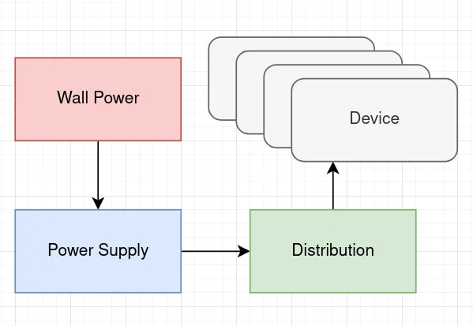
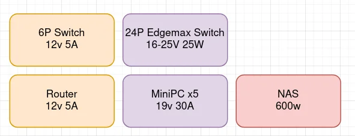
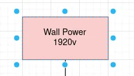
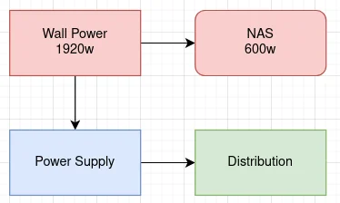
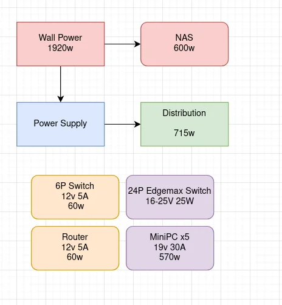
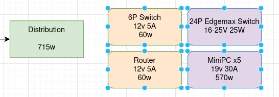

 
## Power, it is already in the wall?

If there is anything I ever learned, it is that someone else has **already** solved your problem, the tricky part is finding and applying it.

## What can we do before my house goes on 🔥

Go look at you panel, find the breaker that connects to your homelab, and do this `math`.

```
(120 x <number on your breaker>) x .8
```

Boom, that is your max wattage you homelab should be rated for.

> For the record, it technically isn't. But your electrician will get very sad. 🙁

Mine is `20`, so my max wattage is `(120 x 20) x .8 = 1920`

### I like your funny words magic man

Alright, you just calculated your maximum `Running Watts`, this defines what you can run your homelab at indefinitely before burning the wires in your walls.

> If you had 15 on the breaker. It would have been `1440` watts, but you already calculated that. right?

## What does my homelab use?

Now, go into your homelab, google your hardware, stare at your power bricks, you need to find the following information.

- If your computer only accepts an AC input
  - What is its max `Watt` rating?
- If your computer/device has an external power brick.
  - What is its `Volts` and `Amps`?

Sort all this together

| Device    | Volts    | Amps    | Watts    |
|---------------- | --------------- | --------------- | --------------- |
| Router | 12   | 5    |  60   |
| 6 port Switch    | 12   | 5   | 60   |
| 24 port edgemax switch    |  16-25  |    |  25  |
| NAS   |    |    | 600   |
| minipc x5   | 19   | 6   |   114 / 570 |

Total it all up, my example shows us as `1315`

Now, total up all your DC external power block devices. Mine is `715`

We now know 3 out of 4 important numbers.

- Your maximum energy bandwidth `1920`
- Your homelab's maximum draw `1315`
- How many watts we can consolidate `715`

> Wait. Why are we doing everything by maximum usage? My homelab does not run at full power all of the time? - You, probably

This is how your ('Merica) electrical code is written. It assumes you will be absolutely loony enough to run your heater, AC, Oven, Microwave, Dryer, Washer, Dog blanket and 3 space heaters at the same time.

Finding your average usage is more of a cost savings process than capacity planning for what we are doing. Your welcome to grab your **Kill-A-Watt** but we will not be using it.


## Lets grab our handy notebook. 📓

Behold, the ***GRAPH***

 

As small as it looks. This is our master plan. I promise.

### Label your graph
#### Label your devices

 

#### Label your Wall Power

 

#### Separate your DC and AC devices

 

#### Determine your DC load

 

### Problem 1: The Power Supply

Your power supply needs to be able to provide your homelab at full load. I am using a 1000w server power supply, but you could also use ATX power supplies, cheap amazon power supplies, or anything else you can find.

To find if your power supply can handle the load, make sure it has the right wattage listed for your predicted max load.

### Problem 2: Distribution

 

There are **two** kinds of distribution problems we need to solve.

#### Problem 2.1 End User

The end user, meaning your device, server, or branch networks, are going to have their own requirements on what voltage they are expecting.

If your end user voltage is **different** from your backhaul voltage. you will need to use either a buck or boost converter to adjust the voltage. I would recommend grouping these loads together to save parts.

 

#### Problem 2.2 Backhaul

Keep the below in mind.

[Wire size guide](https://www.youtube.com/watch?v=O2XOCy2zHG0) 

In general, the higher your backhaul voltage, the smaller wires you can use for the same power, We will need this at its largest rating off of the power supply. But a way to reduce long large wires is to use a distribution box with fuses for your smaller branches.

 

We need the fuses to protect the wires during a fault. If we have a fault on underrated unfused wire. We have a 🔥 hazard. The wire will go hot, and melt.

This allows you to use more, but smaller wires, to power your loads. This is great for smaller setups, but not for large setups. 1000w at 12v is 90 amps, this requires large wires and fuses.

### Problem 3 Connectors

In short, Anderson powerpoles and xt30 are great for anything under 30 amps. XT60 is great for higher currents, XT90 is also a thing.

### Implementation

Thats up next...
