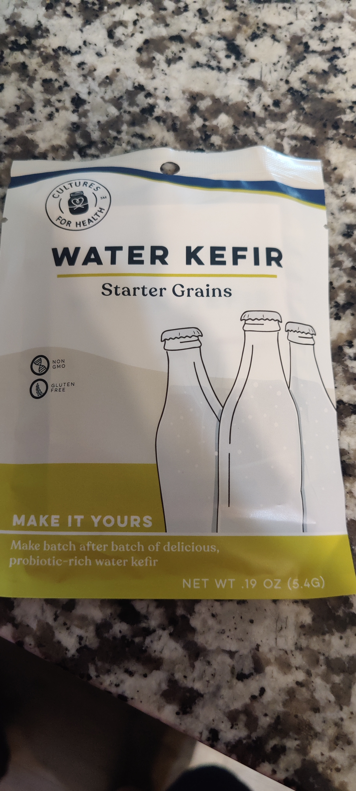
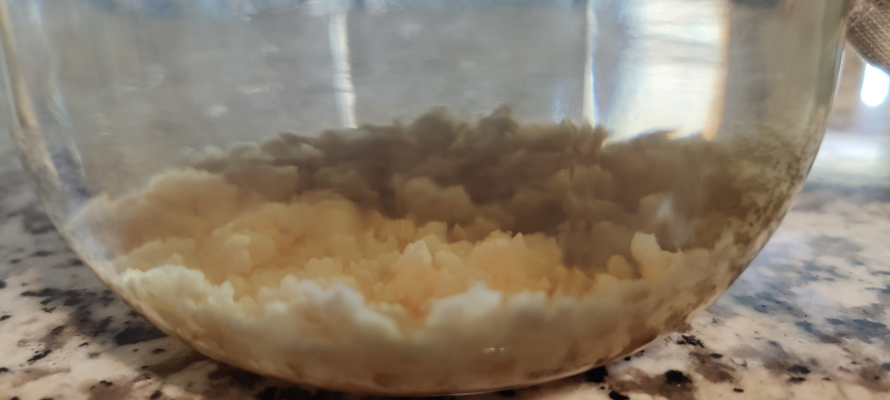
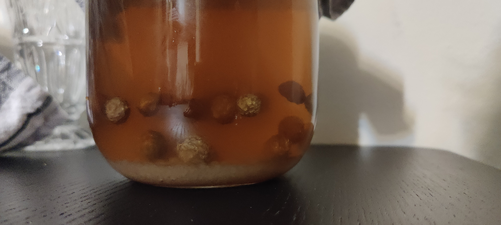

## Inspiration
_First_, I would like to thank  **TheBruShow**  To inspire me trying this out, Please take a watch if this sounds interesting to you



---

## Introduction

### What is Water Keifer anyways?

In short, it's a _fermenting_ product. Meaning a bacteria/yeast that will consume sugar, then produce `CO2` and good ol' `alchohol` _(but in insignificant amounts in this case)_.

Water Keifer is a specific combination of the bacteria and yeast. When given sugar water (or something akin to fruit juice). You end up with a somewhat yeasty tasting liquid that does not have the acidity that most would expect from a similar product called `Kombucha`. However, the fun comes with putting them into sealed bottles that can hold pressure, like those `Kombucha` bottles some of us may or may not have been collecting. You end up with a semi-sweet drink that is as fizzy as soda from a can.

 

## Strong start

I grabbed the dehydrated grains from the same place **TheBruShow**  grabbed his.
I attempted to rehydrate it, but was having issues with the actual fermentation until I used some `rasins` and `raw cane sugar` about 4 days later.
The first actually fermented batches worked flawlessly, tasted great and has a roundtrip time of hours, instead of a week with my normal kombucha. I would leave the bottles on the table overnight, and they would fizz to *cannon* level pressures by morning. Time to start playing with special juices...


  
  
  


## Sickening Halt

Things started to go wrong with my attempt for a strange juice with *Strawberry Banana Orange*. I was already skeptical as it was not my first choice... but figured it would be worth a shot.

I mixed my grains with the `sketch juice` and `raisins` to keep the fast fermentation going. Little did I know something bad was going to start happening.
The next day, there was a layer of `dense foam` on the top, not like a carbonation fizz, I decided to bottle it anyways, and prep the second batch with a juice combo I like with no rasins.
I tested my `sketch juice` the next day, It tasted bad. I considered the banana to be the culprit and tossed my bottles, waiting for my current batch in the next 2 days.

The day after, on 2023-07-25. I tasted the new batch, my mouth was overtaken by what I could only describe as rot. It took every ounce of willpower to not hurl on the floor after spitting it out on the sink.

After gathering my senses _(and my stomach)_. I realized it was the same taste as the `sketch juice` x100, but none of those ingredients were present in this batch.

I've tossed my grains for now. I plan to grab a new set soon. I'll be attempting to do a more pure set of grains. But I may just been unlucky.

## Final thoughts

I had fun, not the first time I made something rotten. (Some day I'll write about the `fuzzy pickle` incident.) But I would still recommend giving Water Keifer a try, do not try to use stupid juices like I did. Stick to typical fruits.

# Attributions
- https://www.flickr.com/photos/williamolyolson/
- https://commons.wikimedia.org/wiki/File:Kombucha,_Synergy_Organic_bottles.jpg
