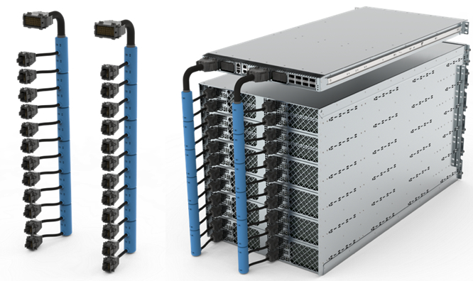

# What even is OpenCompute and Open19/SSIA?
OpenCompute and SSIA are projects to either redefine, or provide extra definition to how a server rack should be designed and interacted with. The idea behind both is that the *current* way of how server racks are defined tend to get disorganized when you install racks full of computers. These attempt to resolve power and density in their own ways.

## OpenCompute

### What does OpenCompute bring to the table
Opencompute touches multiple aspects of the datacenter, but we are most interested in [rack and power](https://www.opencompute.org/wiki/Open_Rack/SpecsAndDesigns) 
### What does a server's footprint look like?
Opencompute includes a definition that essentially means "it can fit in a 19 inch rack", this is not much different from what we have now.
### What does power look like?
 
Opencompute uses a 48V bus bar, when fully installed, this 48v bus will feed the equipment via a connector on the back of the device, it is up to the equipment to regulate to its proper internal voltage. Power is fed from 1 or more "power shelves" which are dedicated devices with multiple load-sharing and redundant power supplies feedings them.
### What does networking look like?
OpenCompute does not refine physical network interfaces for ethernet or fiber. Instead they are focused on a network switch that can run customized firmware.

---
## Open19 (now called the [SSIA](https://www.ssia.org/))
 
### What does SSIA bring to the table
SSIA's Documentation can be found [here](https://gitlab.com/open19) 
### What does a server's footprint look like?
 
Open19 does not redefine the rack, it redefines what goes ***in the rack.***

**Cages**, which are 8U tall, hold **Bricks**. which are 1U tall and half a rack unit wide. A brick can be double high, double wide, or anything in-between.

1U servers become redefined as `double wide bricks`

2U servers become redefined as `double wide double high bricks`

There is no 3 or 4 U definitions
 
### What does power look like?
 
Power is fed from 48v power shelves into these... "bus cables"? 🤷.

These cables are slotted into the back of the cages, which then feed the bricks. I am not sure what this means if there is a double trouble brick. The cages do not require each slot to be filled. 
### What does networking look like?

Same idea as power, dense cables. nothing we as homelabers can replicate

---

## What can we bring back to the homelab?
 
[Dan Manner's Homelab ](https://github.com/danmanners) 
### What *could* networking look like?
Networking moves so fast, I think this would be best fit for something we can easily remove and reconnect on the front of a server.

### What *should* power look like?
Both OpenCompute and SSIA decided to have centralized, 48v DC power, I think there are a few lessons we can take from this.

#### Servers do not need redundant power supplies if the power supplies are separated

Power supplies are large, noisy, and cumbersome, in traditional servers, 2 of them may be installed at the same time, both are plugged into AC power to help protect if one power supply fails, but this only protects one server. 

In the homelab, We may have devices that cannot have two power supplies installed at the same time, or it uses an on line DC adapter or wall wart. these take up space on both your rack and on your limited wall sockets.

#### You could use larger, higher quality power supplies to handle the idle load of multiple servers

Most power supplies are running at idle. If multiple servers are able to benefit from centralized redundancy. They can benefit from better quality power supplies as well.

#### High voltages require smaller wires
Its true, the higher the volts, the lower the amps, 1000 Watts is either 84 Amps at 12V, or 20 amps at 48 volts, this goes from needing 3 AWG cables to 14 AWG cables. for reference, 3 AWG is what is used to feed your house's electrical panel! 14 awg is similar to what you use to feed your normal wall plugs. The price for cables alone could be a huge factor

### What *does* a homelabserver's footprint look like?
This is where I think Open19's bricks have some merit. We now have devices like Intel Nucs, Minisforums, Pis, Laptop, and desktops in our homelab. while I dont think we need to define *cages* and *bricks*, something smaller than 1U should have something they can interact with, on the other hand, larger devices like desktops and laptops should be able to convert 48V to whatever they need to work.

## It's time the homelab learned to hyper scale!

Here I will announce my personal project, **HomeCompute**, where I try to implement a homelab in Opencompute/Open19 style, but in a way a normal(ish) person can do.

First things first... that power problem.
